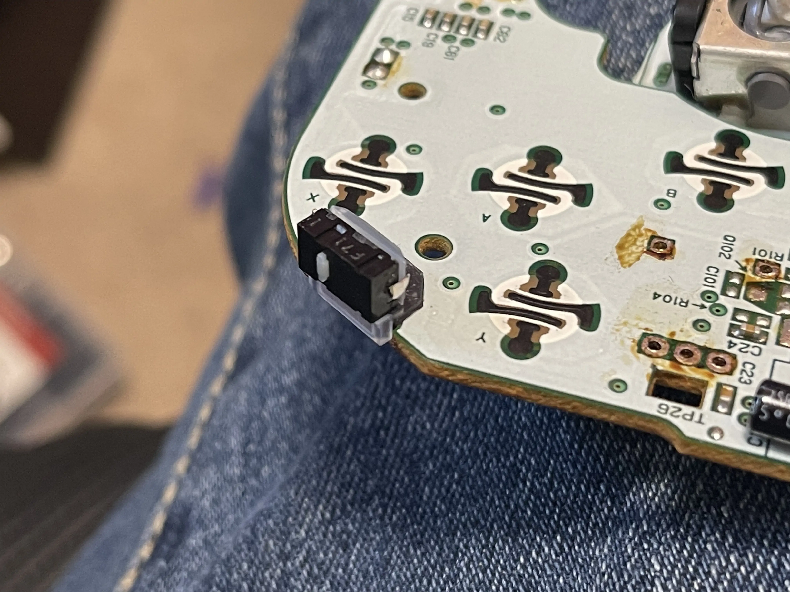
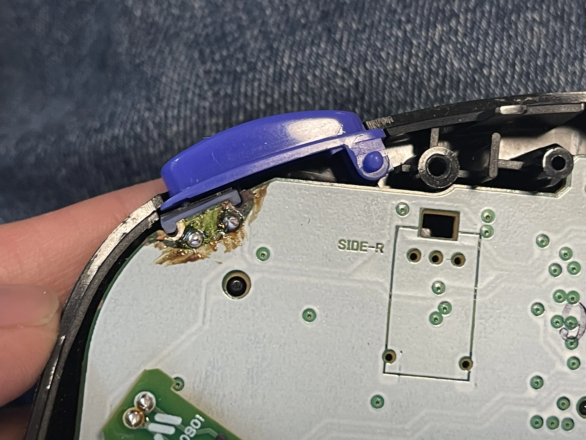
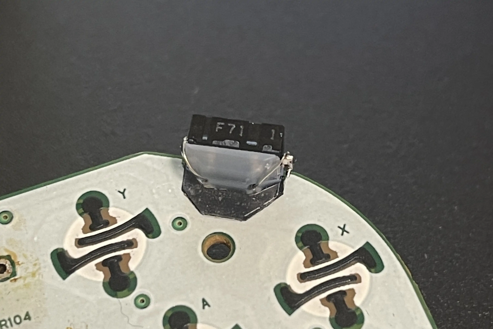

# gcc-mouseswitch-z

## What is it

This is a bracket designed to make installing Omrom D2LS mouse switches to the Nintendo Gamecube Z buttons a lot easier and more consistent.  

### Features

- Universal brackets work on Phob, Goomwave, and OEM controllers.
- This involves no shell cutting or hot glue to form the bracket.
- V3 of bracket makes the tolerance looser for and easier fit on all controllers/switches.

The full design files and STL files are here so users can produce them themselves. A high quality resin printer and durable resin are required to print. 

> Services such as [Hubs](https://www.hubs.com/) or [Protolabs](https://www.protolabs.com/) can create the brackets.

The actual mod has a small footprint like a traditional Z button and has no hanging wires, because it is attached to the PCB rather than the actual shell. It also uses the front shell's plastic shell for additional support once installed.

## Photos

# References 

## Websites

- ~~More details at https://simplecontrollers.bigcartel.com/mouseswitch-z~~ No longer works
- ~~simplecontrollers.com~~ Domain not responsive, at this time

## Parts

- Recommended Switch: [D2LS-11](https://www.digikey.com/en/products/detail/D2LS-11/Z4377CT-ND/5031940)
- Alternative option: (lower force):
[D2LS-21](https://www.digikey.com/en/products/detail/omron-electronics-inc-emc-div/D2LS-21/5031942)
